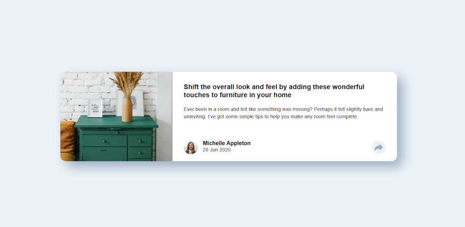

# Article Preview component

This is a solution to the [Article preview component challenge on Frontend Mentor](https://www.frontendmentor.io/challenges/article-preview-component-dYBN_pYFT). Frontend Mentor challenges help you improve your coding skills by building realistic projects. 

## Table of contents

- [Overview](#overview)
  - [Screenshot](#screenshot)
  - [Links](#links)
- [My process](#my-process)
  - [Built with](#built-with)
  - [What I learned](#what-i-learned)
  - [Continued development](#continued-development)
  - [Useful resources](#useful-resources)
  - [AI Collaboration](#ai-collaboration)
- [Author](#author)

**Note: Delete this note and update the table of contents based on what sections you keep.**

## Overview

### Screenshot

Mobile view with share overlay visible.


Desktop view with share popup visible.



### Links

- Solution URL: 
- Live Site URL: 

## My process

### Built with

- Semantic HTML5 markup
- CSS custom properties
- Flexbox & CSS Grid
- Mobile-first workflow
- [Vite](https://vite.dev/)
- [LightningCSS](https://lightningcss.dev/)

### What I learned

My initial implementation used JavaScript for wiring up button clicks and positioning the overlays 
of the share menu. But then, I discovered the `popover` and `anchor` APIs (which have been widely 
supported for two years at this time), and cghanged to using that. This meant that I was able to 
completely implement the UI in `html` and `css`!

On my journey towards a more disciplined and value-driven semantic HTML, I tried to think from the
perspective of a screen reader about the markup: using `articles` for sections that could be stand-alone
and `section`s for discreet subsections of copntent.

```html
<main>
  <article class="article">
    <picture>
      
    </picture>
    <section class="advice">
      <h2>
        <!-- Other markup and content -->
```
I made use of both the `popover` and `anchor` CSS APIs, despite them both being relatively new&mdash;last
two years as of this writing&mdash;this was also a learning-curve for me and I will make use of them
again.

```css
.proud-of-this-css {
  color: papayawhip;
}
```

### Continued development

- For the `popover` and `anchor` tags I watched Kevin Powell's excellent [CSS Popover + Anchor Positioning is Magical](https://youtu.be/DNXEORSk4GU).

### AI Collaboration

I did not make any use of AIs beyond auto-complete for this project. 

## Author

- Frontend Mentor - [Francis Judge](https://www.frontendmentor.io/profile/FJSolutions)
